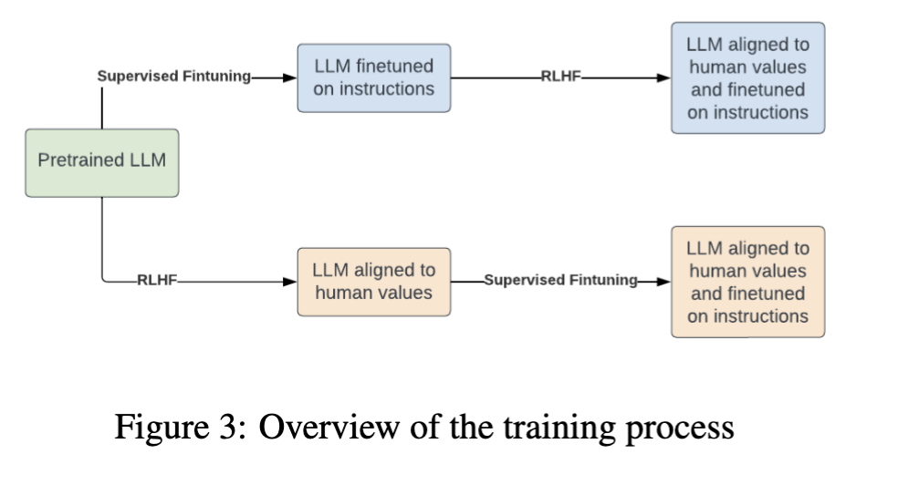
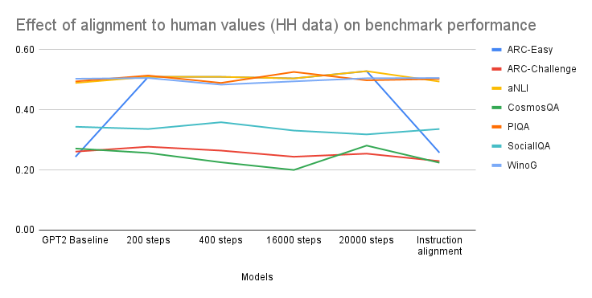

# Are Methods for Aligning LLMs Prone to Catastrophic Forgetting?

This repository contains the implementation, dataset references, and results for a study investigating catastrophic forgetting in Large Language Models (LLMs) during sequential alignment. The study focuses on how finetuning a language model to follow instructions or adhere to human values affects its retention of previously learned abilities, such as commonsense reasoning.

## Project Overview

Modern LLMs are frequently aligned to evolving tasks via sequential finetuning due to the high cost of full retraining. This raises the challenge of **catastrophic forgetting**, where performance on earlier tasks degrades after training on new ones.

This project addresses:
- The extent of catastrophic forgetting in **GPT2-medium**
- Alignment using **Supervised Finetuning (SFT)** and **Reinforcement Learning with Human Feedback (RLHF)**
- Impact on commonsense reasoning tasks throughout the alignment process

## Training Overview

The training process consisted of two main alignment sequences starting from a pretrained GPT2-medium model:

- SFT followed by RLHF
- RLHF followed by SFT

The diagram below illustrates this process:

*Figure 1: Overview of the training process*

## Methodology

### Model

- **GPT2-medium** (355M parameters): A smaller variant of OpenAI’s GPT-2 model, used due to resource constraints.

### Alignment Techniques

- **Supervised Finetuning (SFT)** on the Super-Natural Instructions dataset
- **Reinforcement Learning with Human Feedback (RLHF)** using the Helpfulness and Harmfulness (HH) dataset and a PPO-trained reward model

### Datasets

**Alignment Datasets:**
- **Super-Natural Instructions:** Instruction-based NLP tasks across various domains
- **Helpfulness and Harmfulness (HH):** Conversations labeled for helpful and harmless responses

**Benchmark Datasets:**
Used to measure instruction-following and commonsense reasoning at different training stages:
- ARC (Easy and Challenge)
- RAINBOW benchmark suite: aNLI, PiQA, SiQA, CosmosQA, WinoGrande

## Training Configuration

| Method       | Learning Rate | Scheduler | Epochs | Batch Size | Max Input Length | GPU              |
|--------------|----------------|-----------|--------|-------------|------------------|------------------|
| SFT          | 5e-4           | Cosine    | 2      | 4           | 512              | Tesla V100 16GB  |
| RLHF         | 1e-4           | -         | 1      | 16          | 1024             | Tesla T4 16GB    |

## Results and Analysis

The performance of the model was evaluated at multiple checkpoints across the alignment process. The figure below shows how performance on commonsense reasoning benchmarks changed during alignment to human values using RLHF:

*Figure 2: Effect of alignment to human values (HH data) on benchmark performance*

Key observations:
- Instruction tuning initially improved task performance, with a decline after 41.5k steps due to overfitting
- RLHF improved ARC-Easy performance significantly, with neutral or slightly negative impact on other datasets
- Minimal catastrophic forgetting observed, likely due to the smaller model size

## Conclusion

This project replicates aspects of Luo et al. (2023), using a smaller-scale setup. Our findings suggest that:
- Catastrophic forgetting is less pronounced in smaller models like GPT2-medium
- Instruction tuning and value alignment each introduce trade-offs
- Larger models and more data may be required to observe significant forgetting or improvement

Future directions:
- Apply alignment techniques to larger models
- Investigate the effect of different reward models on RLHF outcomes
- Explore Parameter-Efficient Fine-Tuning (PEFT) for resource-constrained settings

## Team Members

- Pegah Alipoormolabashi  
- Dikshya Mohanty
- Kalina Kostyszyn  
- Arash Karimi  

## References

Please refer to `ML_project_report.pdf` in this repository (reports folder) for full references to prior work and datasets used.
